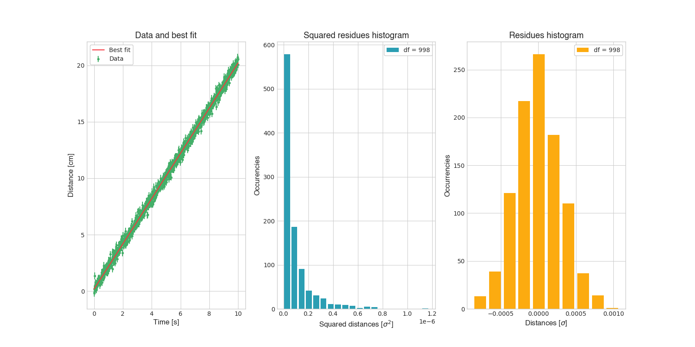

# Dali
Dali (Data Analysis and Laboratory Instrumentation) is a Python library created for my laboratory courses.
Dali was made to speed up tasks like plotting, data analysis and more, and was designed to be quite versatile
as well as fast and reliable. Feel free to contribute by forking and opening pull requests. 

## Planned roadmap

Dali is still a very basic project with little core functionality, however it can speed up redundant and boring tasks by ~200%.
Here is a list of all the features implemented so far:

- [x] Basic plotting (plot, errorbar and histogram) 
- [x] Support for multiple plots (max 3)
- [x] Multiple color palettes and designed to be stylish
- [x] Organized output folder for images 
- [x] Basic algorithms for data analysis (Clusterization, Data cleaner)
- [x] LaTeX support for exporting measurements (Measurements and data tables)
- [x] Deployment as a Python package
- [ ] Support for other types of plots (Spectrogram and more)

## Install 

To install Dali, simply use:

```
pip install dali_lib
```

To use it in your own project, use:

```python
import Dali

# Your code...
```

## Usage Example

The following code will produce this output:



```python
from Dali import *

def main():
    sigma = 0.3

    x = np.linspace(0, 10, 1000)
    y = LinearMap(x, 2, 0.2)
    y += np.random.randn(len(x)) * sigma

    p, cov = CurveFit(LinearMap, x, y, sigma=[sigma] * len(x), absolute_sigma=True)

    PlotErrorData(x, y, None, [sigma]*len(y), 'Data and best fit', 'Time [s]', 'Distance [cm]', legend = 'Data')
    PlotFit(x, LinearMap(x, *p))

    ChangePlotIndex(1)
    PlotHistogram(EvalSquareResidues(y, LinearMap(x, *p), len(x) - 2), 'Squared residues histogram', 'Squared distances [$\\sigma^2$]', 'Occurencies', bins = 20, legend=f'df = {len(x) - 2}')

    ChangePlotIndex(2)
    PlotHistogram(EvalResidues(y, LinearMap(x, *p), len(x) - 2), 'Residues histogram', 'Distances [$\\sigma$]', 'Frequencies', legend=f'df = {len(x) - 2}')

    ShowPlot('Trimosaic.png')

if __name__ == '__main__':
    InitPlotMode(mode = 'trimosaic', figSize = (16, 8), palette = 'Funky', path = 'Images/')
    main()
```


